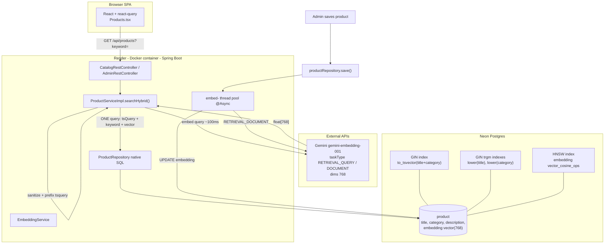
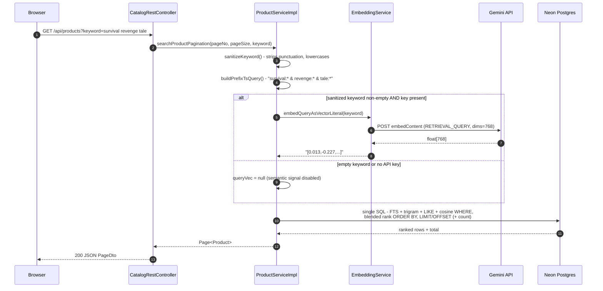
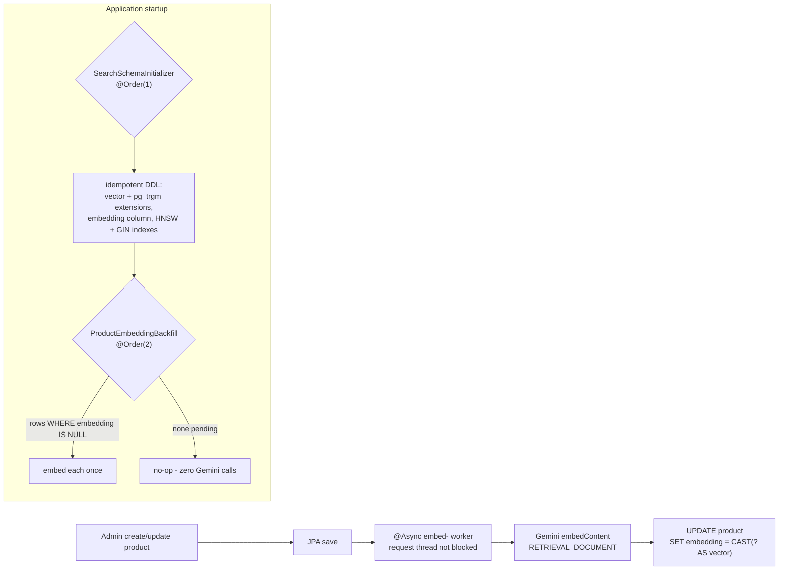

# Search Service Architecture

Hybrid product search combining four matching signals in a single Postgres query,
with semantic understanding powered by Gemini embeddings stored via pgvector.

## Components

## Read path - every search

## Write path - keeping embeddings fresh

## Matching signals

| # | Signal | Backed by | Matches | Example |
|---|--------|-----------|---------|---------|
| 1 | FTS `ts_rank` | GIN `to_tsvector('english', title+category)` | whole words + stems | `saga` |
| 2 | Trigram `%` | GIN `lower(title/category) gin_trgm_ops` | typos | `vinlad` → Vinland Saga |
| 3 | Substring `LIKE` | same trigram GIN indexes | fragments (len >= 2) | `ind` → Wind Breaker |
| 4 | Cosine `<=>` | HNSW on `embedding` (distance < 0.34) | meaning, zero word overlap | survival revenge tale |

Blended ranking: `ts_rank*2 + greatest(trigram similarity) + (1 - cosine distance)`.

## Behavior guarantees

| Scenario | Behavior |
|----------|----------|
| Blank / punctuation-only input | Browse path or guarded empty result - **no Gemini call** |
| Gemini down / key missing | Signal 4 silently dropped; literal signals still return results (`semantic=false` logged) |
| Semantic quota exhausted | `SearchRateLimiter` skips signal 4 for that identity; keyword results still served. Limits (per minute/day): anonymous 5/30, logged-in 10/75, global circuit breaker 200/day; admins exempt |
| Repeat search | Served from react-query cache - zero server hops |
| New product not yet embedded | Found by signals 1-3 immediately; semantic after async embed lands |
| Fresh database | Schema auto-created at boot; backfill embeds existing rows once |
